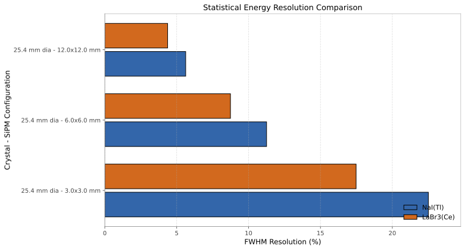
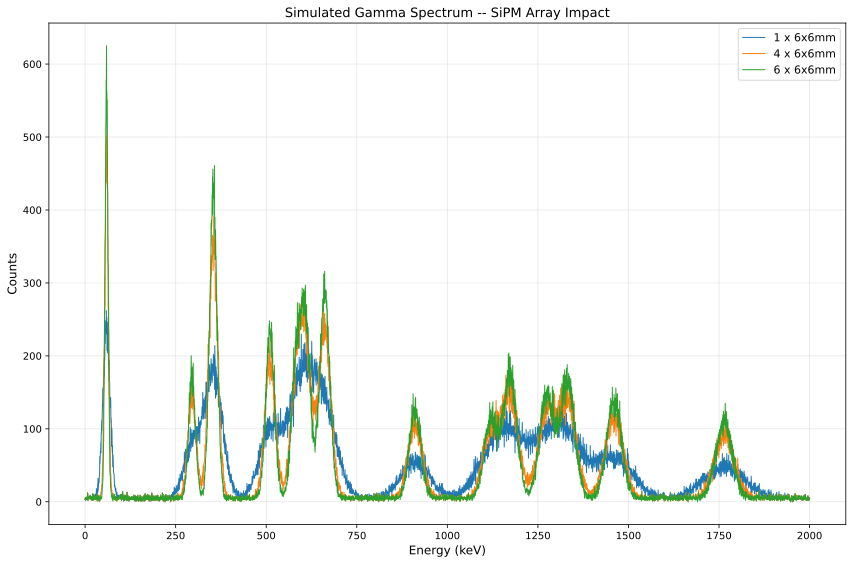
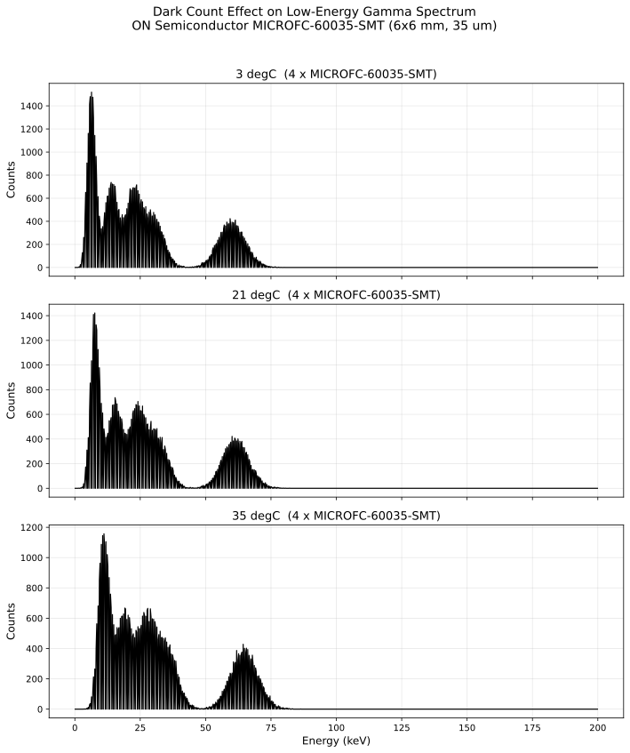

# Detector Architecture Studies

## Purpouse

The objective is to establish detector physics limits and evaluate
whether electronic performance exceeds fundamental scintillation limits.

$$
\sigma_{electronics} \ll \sigma_{scintillation}
$$

The detector physics sets the floor, electronics should not dominate it.
Anything significantly exceeding this margin is cost overhead, not performance gain.

---

## Study Index

| Study | File | Description |
|---|---|---|
| resolution_geometry_study | Analysis.ipynb | Resolution vs crystal/SiPM geometry |
| sipm_array_spectrum | Analysis.ipynb | Spectrum vs SiPM array size |
| dark_count | Analysis.ipynb | Temperature-dependent dark noise impact |

---

## Study 1 -- Resolution Geometry Study

### Question

How does crystal diameter and SiPM size affect statistical energy resolution?

### Parameters Swept

    Crystal diameters : [25.4, 38.0, 50.0] mm
    SiPM sizes        : [6.0, 10.0, 25.4] mm
    Scintillators     : NaI(Tl), LaBr3(Ce)

### Fixed Parameters

    Reference energy    : 0.662 MeV
    PDE                 : 0.35
    Optical efficiency  : 0.70

### Output

### Key Findings

* Larger SiPM relative to crystal -> better coverage -> lower FWHM
* LaBr3(Ce) consistently outperforms NaI(Tl) due to higher light yield
* At small crystal diameter (25.4 mm), even 6x6 mm SiPM gives meaningful coverage
* At large crystal diameter (50.0 mm), coverage drops significantly unless SiPM size is matched

---

## Study 2 -- SiPM Array Spectrum Study

### Scientific Question

How does increasing the number of SiPMs affect observable spectral peak separation and resolution?

### Resolution Scaling Model

Adding N identical SiPMs in parallel scales resolution as:

    FWHM(N) = FWHM_single / sqrt(N_sipm)

### SiPM Configurations Compared

    1 x 6x6 mm  ->  n_sipm = 1
    4 x 6x6 mm  ->  n_sipm = 4
    6 x 6x6 mm  ->  n_sipm = 6

### Output

   
### Key Findings

    * Array scaling gives diminishing returns beyond ~4 SiPMs
    * Peak separation becomes clearly visible at n_sipm = 4
    * Background rate has visible impact at low-energy lines

---

## Study 3 -- Dark Count Noise Study

### Question

At what temperature does dark count noise begin to degrade
low-energy gamma detection?

### SiPM Device

    ON Semiconductor MICROFC-60035-SMT
    Active area  : 6 x 6 mm
    Microcell    : 35 um pitch
    Array config : 4 x SiPM

### Temperature Points

    [3, 21, 35] degC

### Low-Energy Isotopes Simulated

    Fe-55   :  5.9 keV
    Am-241  : 13.5 keV
    Cd-109  : 22.0 keV
    Ba-133  : 30.0 keV
    Am-241  : 59.5 keV

### Output

### Key Findings

    - Dark count rate increases significantly with temperature
    - At 35degC the noise floor begins to obscure sub-10 keV lines
    - Cooling to 3degC substantially suppresses the noise continuum

