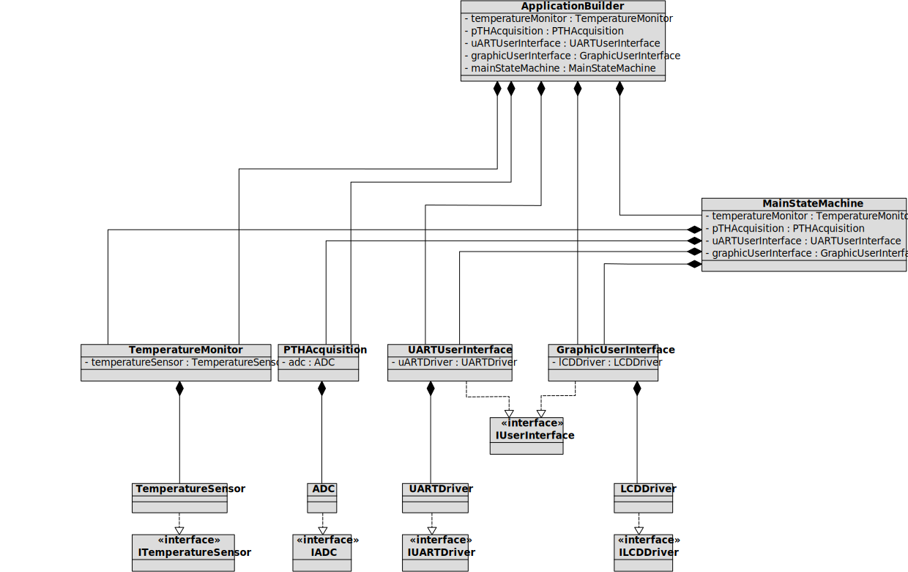

# UML Diagrams

## Umbrello Configuration

Font: Microsoft New Tai Lue, Font style: Normal, Font size: 11
Diagram properties -> Style: Text: #000000, Line: #000000, Fill: #DCDCDC

Note: Umbrello is not the most stable software, it can mess diagrams out of nowhere, save your work frequently.

Note: below diagrams will probably change a lot.

##  Use Case Diagram

##  State Diagram

##  Class Diagram Diagram

