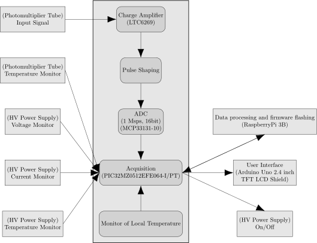

# HighVoltagePowerSupply

## Architecture Overview of High Voltage Power Supply



## Assumptions

PHT output voltage after amplification will be in range 0-10V and width of 3us.

After pulse shaping it will be in range 0-2V5 and width of 20us.

1 Msps, 16bit ADC will be used [MCP33131-10](https://www.tme.eu/Document/a5a4283a1bfa7721eddf2e7bc5de5352/MCP33131-MCP33121-MCP33111.pdf)

Least significant bit (LSB) voltage:

```Q = 2.5V / (2^16) = 35uV```
