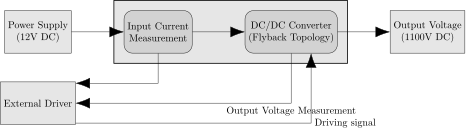
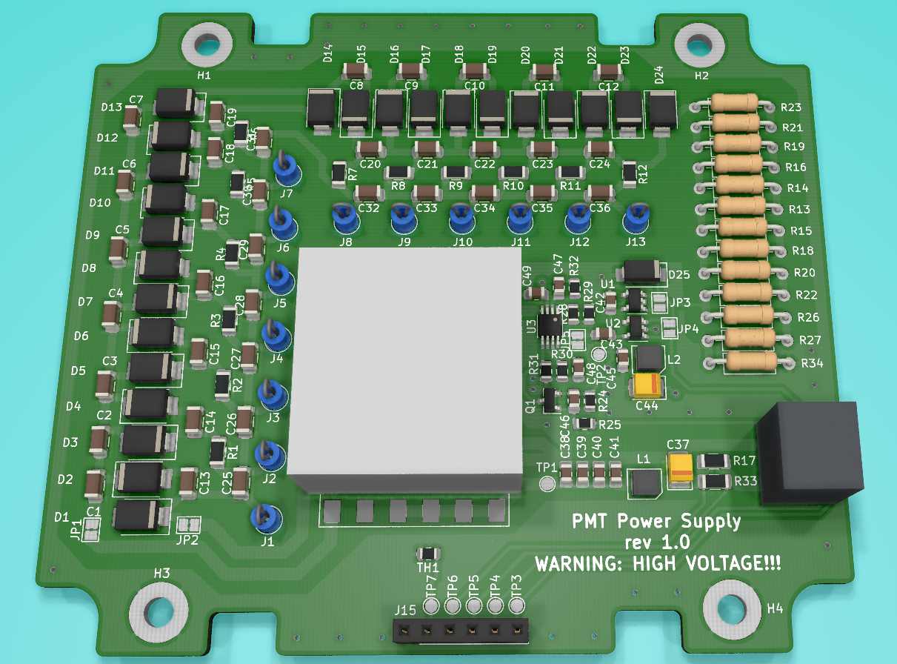

# HighVoltagePowerSupply

## Architecture Overview of High Voltage Power Supply

## Render of the PCB

## Assumptions about used elements

Topology: Flyback
Mode: Discontinuous Conduction Mode

- All resistors in voltage divider should be rated 150V or more and have the same temperature coefficient.

## PCB clearance 

Calculations based on [IPC-2221A](http://www-eng.lbl.gov/~shuman/NEXT/CURRENT_DESIGN/TP/MATERIALS/IPC-2221A(L).pdf#page=52&zoom=100,0,0), Table 1-6.

1100V - 500V = 600V
0.25 mm + (600V * 0.0025 mm) = 
0.25  + (600 * 0.0025) = 1.75mm
