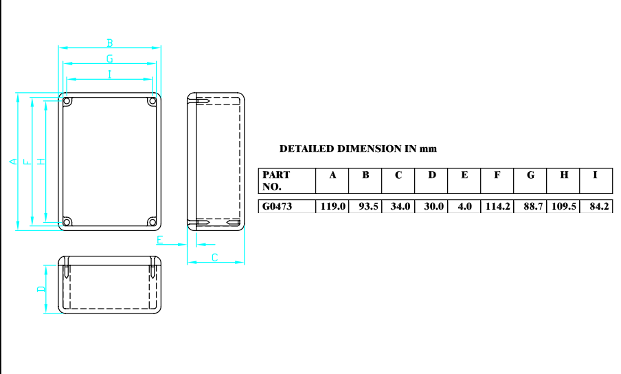
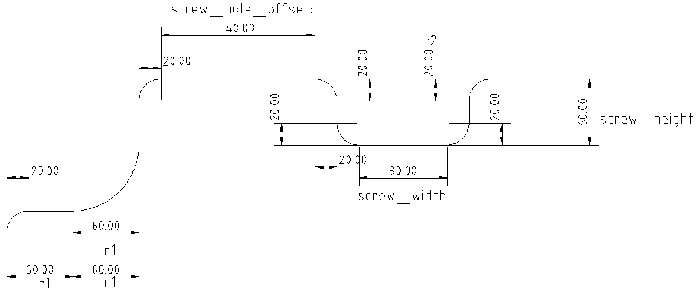

# PCB Outlines Calculator

This is the calculator of PCB outlines for __high voltage power supply__ and for __acquisition__. It takes into account:

- Chassis dimensions.
- Need for free space for screws that mount chassis to external construction.

## Chassis dimensions

Below is edited [original datasheet](https://www.tme.eu/Document/b8d1c5b7150d723059cd3387bfd1b257/G0123.pdf) with removed pointless info about other products.



## Usage

In this folder run:

```octave-cli PCBOutlineCalculator.m```

This will print dimensions for PCB outlines, based on that PCB outlines needs to be applied manually in KiCad.

Below is presented a sample of top left corner. PCB is symmetrical in X and Y axis.



Note: dimensions are not correct, but this picture gives idea where those parameters printed by script are on PCB.

Above image was generated using LibreCad, project is located in ./Overview.dxf.
