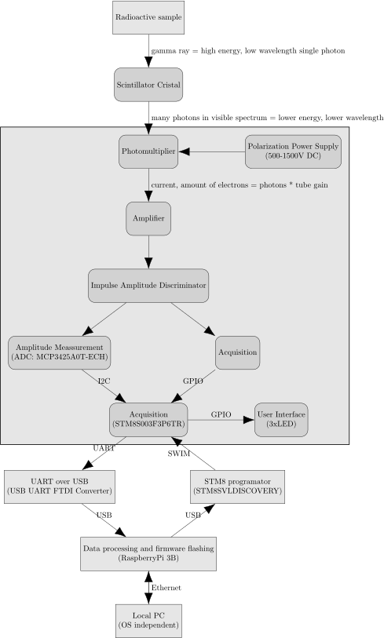
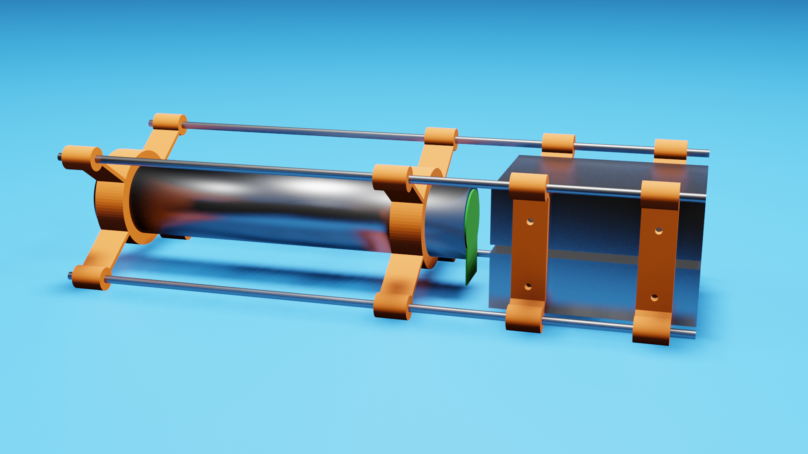

# GammaSpectrometer

 

**This project is unfinished.**

## Principle of operation

This device allows to measure in quantitive way amount of different isotopes in analyzed sample.

It consist of scintillator (a material that converts gamma particle into photons) and photomultiplier tube that multiply those photons and converts them into electric current pulses. by measuring amplitude of those pulses, it is possible to calculate back the original energy of gamma ray that produced the pulse.

Sampling data over a time and plotting its histogram shows what radioactive isotopes are present in measured sample and what is their ratio.

## System architecture

It is designed in a way that the device can work remotely, e.g. no connection via USB cable to user's  PC is needed.

## Overview of the mechanical design

On a left side of the above image is a shield for photomultiplier tube - it's needed to protect the detector from external sources of light and EMI. 
The detector is connected to a small PCB, visible in the center, it contains circuit for polarization of the tube and connectors.
On the right side, on the bottom is visible shield for high voltage generator, on the top is visible shield for data acquisition. 

Parts for 3D printing and model of the whole device were designed in OpenSCAD [[more info]](./Mechanic/MechanicOverview/README.md). Above renderer was done in Blender.

## Hardware

- [Documentation of photomultiplier principles](./Hardware/README.md)
- [Documentation of acquisition module (in progress)](./Hardware/DataAcquisition/README.md)
- [Documentation of HV power supply module](./Hardware/HighVoltagePowerSupply/README.md). Note: values of elements were calculated using model made in Octave [[more info]](./Simulation/Octave/README.md).

PCBs were designed in KiCAD.

## Software

[Details about software architecture.](./Documentation/UML/README.md)

## Hazards

* **The device exposes high voltage to user, although maximum current is limited, it still poses health risk.**
