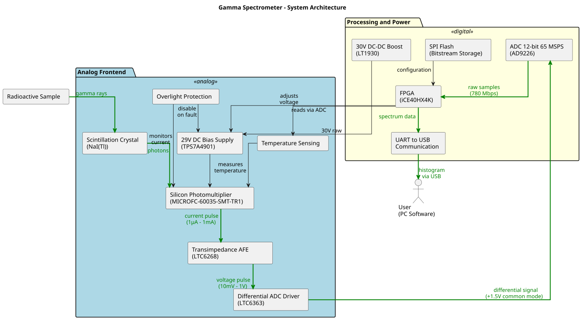

# Silicon Photomultiplier Gamma Spectrometer

  

## Principle of operation

Gamma Spectrometer allows for the quantitative measurement of the amount of different isotopes in an analyzed sample.

It consists of a scintillator (a material that converts gamma particles into photons) and a photomultiplier that multiplies those photons and converts them into electric current pulses. By measuring the amplitude of these pulses, it is possible to calculate the original energy of the gamma ray that produced the pulse.

Sampling data over time and plotting its histogram reveals which radioactive isotopes are present in the measured sample and their respective ratios.

## Design Rationale

### Silicon Photomultiplier vs Traditional PMT

Conventional gamma spectrometers commonly use vacuum photomultiplier tubes (PMTs). These require high-voltage supplies in the kilovolt range, are mechanically fragile, and are sensitive to magnetic fields.

In this project, a Silicon Photomultiplier (SiPM) is used instead. The SiPM operates at significantly lower bias voltage (tens of volts rather than kilovolts), is mechanically robust, compact, and insensitive to magnetic fields. These characteristics simplify the power supply design and mechanical integration.

### Digital vs Analog Processing

Traditional spectrometers implement CR-RC shaping networks and peak detection entirely in analog hardware. This approach is cost-effective but offers limited flexibility, as parameter changes require hardware modification.

In this system, pulse shaping and peak detection are performed digitally after high-speed sampling. This increases flexibility and allows signal processing parameters to be modified in firmware without hardware changes. The trade-off is higher performance requirements for the ADC and the need for an FPGA rather than a microcontroller, which increases overall system cost.

## Hardware

The hardware consists of four main parts:

***Analog Processing***

Handles low-level currents produced by the sensor (typically 1uA - 1mA pulses, 10mV - 1V after amplification):

* **[NaI(Tl) Scintillator Crystal](https://www.ost-photonics.com/product/diameter-1-inch-x-1-inch-naitl-scintillator/)** - Converts gamma rays into visible light pulses through scintillation
* **Silicon Photomultiplier: [MICROFC-60035-SMT-TR1 SiPM](https://www.onsemi.com/pdf/datasheet/microc-series-d.pdf)** - Converts light pulses from the scintillator crystal into electrical current pulses
* **Amplifier: [OPA690](https://www.ti.com/lit/ds/symlink/opa690.pdf)** -  can be configured either as a charge amplifier or as a transimpedance amplifier (TIA), depending on the selected feedback network. In the current design, the amplifier is configured as a charge amplifier.
  * **Charge Amplifier Configuration.** In this mode, the amplifier integrates the input current pulse generated by the SiPM and converts the total collected charge into a proportional output voltage.
    The output voltage is defined by the feedback capacitor:

    $$V_{out} = \frac{Q}{C_f}$$

    This can also be expressed as:

    $$V_{out} = \frac{1}{C_f} \int I(t) \, dt$$

    Where:
    
    **$Q_{in}$**: The total charge generated by the Silicon Photomultiplier (SiPM).

    **$C_f$**: The feedback capacitance of the integrator or transimpedance stage.

    **$I(t)$**: The time-dependent input current pulse from the detector.

  * **Transimpedance Amplifier (TIA) Configuration.** In this configuration, the output voltage is proportional to instantaneous input current:

    $$V_{out} = -I_{in} \cdot R_f$$

    Where:

    **$R_f$**: The feedback resistor that determines the gain of the transimpedance stage.

    **$I_{in}$**: The instantaneous input current flowing from the sensor into the amplifier.

* **Differential ADC Driver: [AD8139](https://www.analog.com/media/en/technical-documentation/data-sheets/AD8139.pdf)** - Converts the single-ended amplifier output into a differential signal suitable for the ADC input. It also sets the required common-mode voltage (1.5 V) needed by ADC.
* **Bias Supply** - Provides a stable and filtered 29 V bias voltage for the SiPM. The bias voltage is adjustable to compensate for temperature-dependent gain variation of the SiPM.
   * [MCP3221](https://ww1.microchip.com/downloads/en/devicedoc/20001732e.pdf) 12-bit I2C ADC measures the SiPM temperature via a thermistor. Since the SiPM gain varies with temperature, this measurement is used by FPGA to adjust the bias voltage
   * [MCP4725xxx-xCH](https://ww1.microchip.com/downloads/en/devicedoc/22039d.pdf) 12-bit I2C DAC generates a control voltage used to adjust the SiPM bias supply. This allows the FPGA to compensate temperature-induced gain variations of SiPM.
   * [LT8330IS6](https://www.analog.com/media/en/technical-documentation/data-sheets/lt8330.pdf) - dc/dc converter generates the raw high-voltage supply for the SiPM bias circuit.
   * [TPS7A49](https://www.ti.com/lit/ds/symlink/tps7a49.pdf?ts=1776866743000&ref_url=https%253A%252F%252Fwww.google.com%252F) - filters and regulates the output of the DC/DC converter, providing a low-noise and stable bias voltage for the SiPM. The output voltage is adjustable via the compensation DAC.
   * **Overcurrent Protection (TBD)** - Cuts bias voltage if SiPM is exposed to external light source, preventing sensor damage from excessive photocurrent

> **Note:** Analog pulse shaping and peak detection are not used - raw signal is digitized directly and processed in FPGA.

***Digital processing***

Performs high-speed sampling and real-time pulse analysis:

- **ADC: [AD9238](https://www.analog.com/media/en/technical-documentation/data-sheets/ad9226.pdf](https://www.analog.com/media/en/technical-documentation/data-sheets/ad9238.pdf))** - 2-channel, 12-bit, 40 MSPS sampling rate. ch channel produces 480 Mbps (60 MB/s), resulting in 960 Mbps (120 MB/s) total sample data rate.
- **FPGA: [iCE40HX4K](https://www.latticesemi.com/en/Products/FPGAandCPLD/iCE40#_21E33C7EC0BD48AA80FE384ED73CC895)** - Real-time digital pulse processing (trapezoidal filtering, peak detection, histogram generation)
- **SPI Flash: [MX25L1606EM1I-12G](https://www.tme.eu/Document/90cf95a7114025302d33a68125e207ab/MX25L1606E.pdf)** - Stores FPGA configuration bitstream
- **SPI Port** - External header for FPGA programming
- **UART to USB Converter: [CH340X](https://cdn.sparkfun.com/assets/5/0/a/8/5/CH340DS1.PDF)** - Communication interface to PC.

**Clock Subsystem**
* to be refined
[511JCA40M0000BAG](https://eu.mouser.com/datasheet/3/564/1/si510_11.pdf) 40MHz, 0.8ps Nom / 1ps Max jitter LVDS clock
**Power Distribution**
* to be refined

[More info.](./Hardware/README.md)

Tools: KiCad.

## Software

The project is developed using a **completely open-source FPGA toolchain**. The RTL code is written in VHDL-2008, synthesized with [Yosys](https://github.com/YosysHQ/yosys) + [GHDL](https://github.com/ghdl/ghdl), and targets iCE40 FPGAs via [nextpnr](https://github.com/YosysHQ/nextpnr). All code will be **formally verified** using [SymbiYosys](https://github.com/YosysHQ/sby) with PSL assertions and **unit tested** using the [VUnit](https://vunit.github.io/) framework.

The entire toolchain is containerized in a Docker image.

[More info.](./Software/README.md)

## Mechanical

The analog frontend requires a metal chassis for protection from electromagnetic interference and external light sources.

The scintillator crystal is mounted inside using a 3D-printed stand.

The crystal and SiPM are optically coupled using optical gel to minimize light pulse reflections at the interface

Tools: OpenSCAD and FreeCAD.

[More info.](./Mechanic/README.md)

## Simulation

### LTspice

* Simulation: [Parts of the electronic circuit are simulated](./Simulation/LTspice/) in LTspice.
* Visualization (optional): The results can be either observed in LTspice or [imported into a Docker-based Jupyter Notebook.](./Simulation/JupyterLab/) This allows for further simulation analysis (although it's not really used for now). Also, the graphs are more aesthetic this way.

## DevOps

[More info.](./DevOps/README.md)
