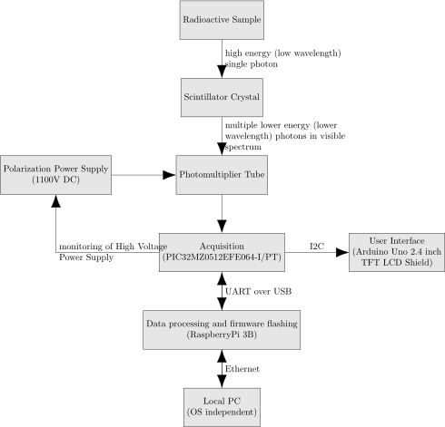

# GammaSpectrometer

 

**This project is unfinished.**

## Principle of operation

This device allows to measure in quantitive way amount of different isotopes in analyzed sample.

It consist of scintillator (a material that converts gamma particle into photons) and photomultiplier tube that multiply those photons and converts them into electric current pulses. by measuring amplitude of those pulses, it is possible to calculate back the original energy of gamma ray that produced the pulse.

Sampling data over a time and plotting its histogram shows what radioactive isotopes are present in measured sample and what is their ratio.

## System architecture

It is designed in a way that the device can work remotely, e.g. no connection via USB cable to user's  PC is needed.

## Hardware

PCB was created using KiCAD.

## Software

TODO

## Hazards

* **The device exposes high voltage to user, although maximum current is limited, it still poses health risk if the sensor external electrode would be touch.**
