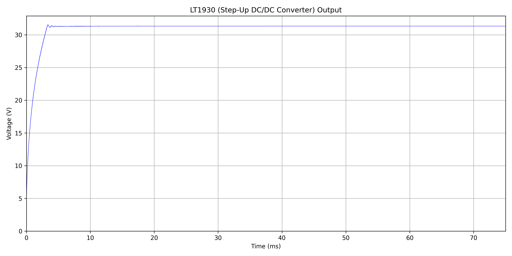
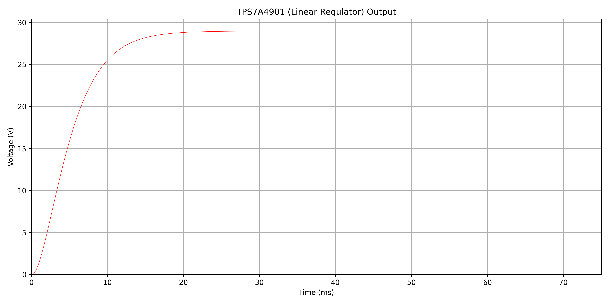
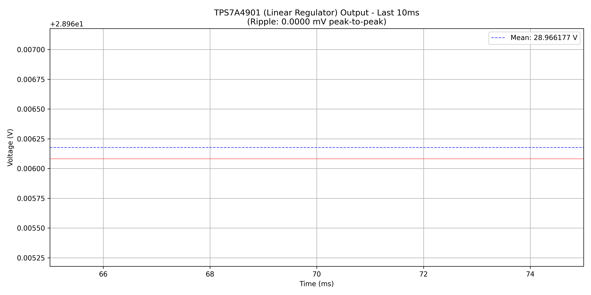
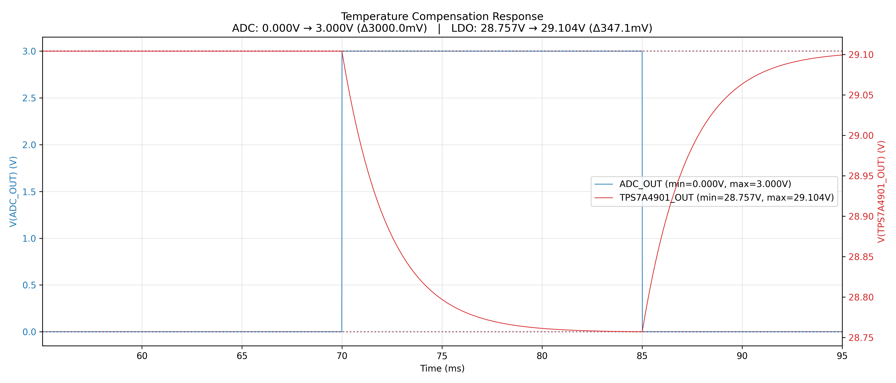

Max safe voltage = 24.2V (min Vbr) + 5.0V = 29.2V

ADC: 0V -> 4.5V (simulating 20°C → 35°C)
LDO: 28.89V -> 29.22V (+322.5mV over 15°C)

Expected slope: 322.5mV / 4.5V = 71.7 mV/V
Expected R²: > 0.999 (highly linear)

